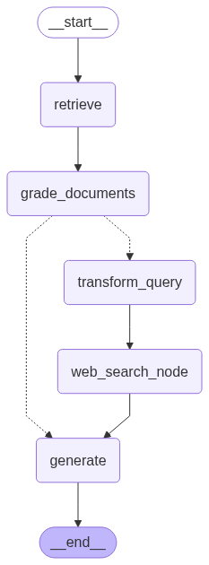

# Corrective-RAG

Corrective-RAG is a Multi-agent Retrieval-Augmented Generation (RAG) system designed to improve the accuracy, reliability, and contextuality of LLM responses. 

Unlike basic RAG pipelines, this system adds **correction layers** through grading, rewriting, and validation agents, ensuring **high-quality knowledge retrieval and generation**.

## 🚀 Key Features

- 📄 **Document Ingestion** → Load and split documents into chunks for efficient retrieval.  
- 🔍 **Retriever with Filtering** → FAISS-based similarity search with threshold filtering.  
- 🤖 **LLM Agents**:
  - **Retriever** → Fetches candidate knowledge chunks.  
  - **Retrieval Grader** → Evaluates if retrieved chunks are relevant to the query.  
  - **Query Transformer** → Refines or rewrites the query only if retrieval fails.  
  - **Web Search Agent** → Expands the context with external knowledge when vectorstore retrieval is insufficient.  
  - **RAG Generator** → Synthesizes context + LLM to produce the final response.  
- 🔄 **Correction Workflow** → If the retrieved docs are irrelevant, the system rewrites the query, performs a web search, and regenerates.  
- 💾 **Vectorstore Persistence** → Save/load FAISS vectorstore for efficient reuse.  

## ⚙️ Workflow

Here’s the actual workflow of **Corrective-RAG**:

## Flow of execution:

1. **Input Question** → User provides a query.  
2. **Retriever** → Fetches top-k candidate documents from the vectorstore.  
3. **Retrieval Grader** → Evaluates if the retrieved docs are relevant:
   - If **relevant ✅** → Pass directly to the **RAG Generator**.  
   - If **irrelevant ❌** → Trigger the corrective path.  
4. **Corrective Path** (only when needed):  
   - **Transform Query** → Rewrite the original question into a clearer one.  
   - **Web Search Node** → Use rewritten query to fetch external knowledge.  
5. **RAG Generator** → Synthesizes either (a) graded vectorstore results, or (b) web search knowledge, to generate the final structured response.
6. **Output Answer** → User receives a corrected, context-grounded, high-quality answer.  

✨ This ensures that the system never stops at irrelevant retrieval — it **adapts dynamically** using rewriting + web search before generating the final answer.

## 🗂️ Project Structure

Corrective-RAG/
│

├── main.py # Main entry point (runs workflow)

│

├── data/

│ └── loaders.py # Load raw documents

│

├── retriever/

│ ├── vectorstore.py # Build & load FAISS vectorstore

│ └── retrieval.py # Retriever configuration

│

├── llm/

│ ├── grader.py # Retrieval grader agent

│ ├── generator.py # RAG generator chain

│ └── rewriter.py # Query transformer agent

│

├── workflow/

│ └── graph.py # Graph workflow definition

│

├── utils/

│ └── formatting.py # Pretty output formatting

│

├── config # ALl the config files urls, GROQ api.

│  

├── entire_pipeline 

│  └── Corrective_RAG.py # All the complete code lies at this single file

|

└── vectorstore_index/ # Saved FAISS index (persistent)

## 🧩 System Flow (High-Level)

- **Question** → Sent to retriever  
- **Retriever** → Pulls top-3 chunks with similarity threshold  
- **Grader** → Validates context relevance  
   - If good → forward to generator  
   - If poor → query is transformed & web search triggered  
- **Generator** → Produces final structured answer  

## 🎯 Why Corrective-RAG?

Traditional RAG often fails when:
- Retrieved docs are irrelevant  
- Queries are ambiguous or incomplete  

Corrective-RAG solves this by:
- ✅ Adding **retrieval grading**  
- ✅ Triggering **query rewriting** only when needed  
- ✅ Expanding with **web search fallback**  
- ✅ Creating a **feedback loop** for reliable answers  

📌 **Result → More trustworthy, context-aware, and production-ready responses.**
